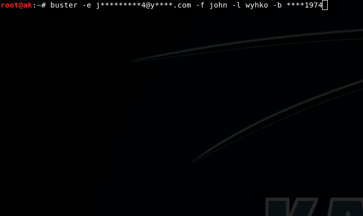

## Description

Buster is an advanced OSINT tool used to:
* Get social accounts of an email using multiple sources(gravatar,about.me,myspace,skype,github,linkedin,previous breaches)
* Get links to where the email was found using google,twitter,darksearch and paste sites
* Get breaches of an email
* Get domains registered with an email (reverse whois)
* Generate possible emails and usernames of a person
* Find the email of a social media account
* Find emails from a username
* Find the work email of a person

A tutorial on how to use Buster can be found [here](https://null-byte.wonderhowto.com/forum/perform-email-reconnaissance-with-buster-0202180/)


-----

## Installation


clone the repository:

```bash
$ git clone git://github.com/sham00n/buster
```

Once you have a copy of the source, you can install it with:

```bash
$ cd buster/
$ python3 setup.py install
$ buster -h
```
-----


## API keys

This project uses hunter.io to get information from company emails,the first couple "company email" searches dont require a key,if you have an interest in company emails i recommend that you sign up for an account on hunter.io.

Once you get an API key, add it to the file "api-keys.yaml" and rerun the command:


```bash
$ python setup.py install
```

-----

## Usage

```
usage: buster [-h] [-e EMAIL] [-f FIRST] [-m MIDDLE] [-l LAST] [-b BIRTHDATE]
              [-a ADDINFO [ADDINFO ...]] [-u USERNAME] [-c COMPANY]
              [-p PROVIDERS [PROVIDERS ...]] [-o OUTPUT] [-v] [--list LIST]

Buster is an OSINT tool used to generate and verify emails and return
information associated with them

optional arguments:
  -h, --help            show this help message and exit
  -e EMAIL, --email EMAIL
                        email adress or email pattern
  -f FIRST, --first FIRST
                        first name
  -m MIDDLE, --middle MIDDLE
                        middle name
  -l LAST, --last LAST  last name
  -b BIRTHDATE, --birthdate BIRTHDATE
                        birthdate in ddmmyyyy format,type * if you dont
                        know(ex:****1967,3104****)
  -a ADDINFO [ADDINFO ...], --addinfo ADDINFO [ADDINFO ...]
                        additional info to help guessing the
                        email(ex:king,345981)
  -u USERNAME, --username USERNAME
                        checks 100+ email providers for the availability of
                        username@provider.com
  -c COMPANY, --company COMPANY
                        company domain
  -p PROVIDERS [PROVIDERS ...], --providers PROVIDERS [PROVIDERS ...]
                        email provider domains
  -o OUTPUT, --output OUTPUT
                        output to a file
  -v, --validate        check which emails are valid and returns information
                        of each one
  --list LIST           file containing list of emails

```

-----

## Usage examples

###### Get info of a single email(exists or not,social media where email was used,data breaches,pastes and links to where it was found)

```bash
$ buster -e target@example.com
```

###### Query for list of emails`
```bash
$ buster --list emails.txt
```

###### Generate emails that matches the pattern and checks if they exist or not(use the -a argument if you have more info to add(ex: -a nickname fav_color phone #)
```bash
$ buster -e j********9@g****.com -f john -l doe -b ****1989
```

###### Generate usernames (use with -o option and input the file to recon-ng's profiler module)
```bash
$ buster -f john -m james -l doe -b 13071989 
```

###### Generate emails (use -v if you want to validate and get info of each email)

```bash
$ buster -f john -m james -l doe -b 13071989 -p gmail.com yahoo.com
```

###### Generate 100+ emails in the format username@provider.com and returns the valid ones(use -p if you dont want all 100+)

```bash
$ buster -u johndoe
```

###### Generate a company email and returns info associated with it

```bash
$ buster -f john -l doe -c company.com
```

-----

## Tips
* You get 200 email validations/day,use them wisely!
* When using the -a option,avoid using small words(ex:j,3,66),the shorter the words are the bigger the email list is and therefore more validations are needed
* when adding an email pattern make sure the service providing the pattern displays it with the right size(facebook,twitter,instagram do...others might not)
* I dont recommend using with Tor as haveibeenpwnd.com,hunter.io and google wont function properly


-----

## Thanks

* [emailrep.io](https://emailrep.io/) for being developer friendly
* khast3x,developer of [h8mail](https://github.com/khast3x/h8mail) which was used as a reference for this README file
* The OSINT community for being awesome!

-----

## Notes
* My Code is ugly,i know...if you know how to do things better let me know!
* If you have any suggestions or improvements email me at sham00n at protonmail dot com


___


